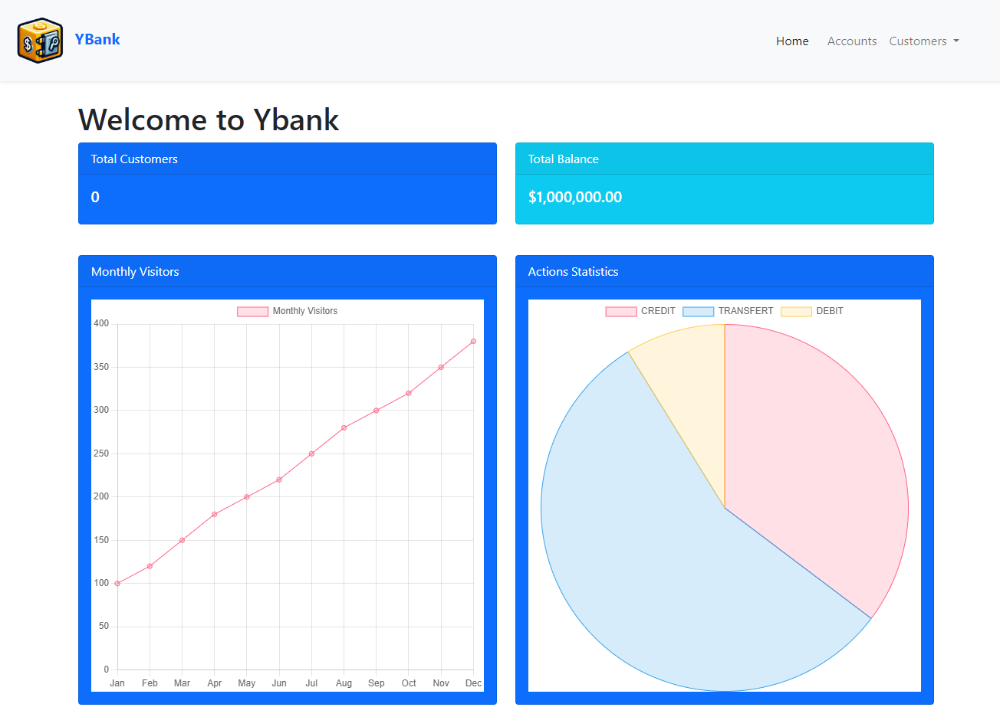
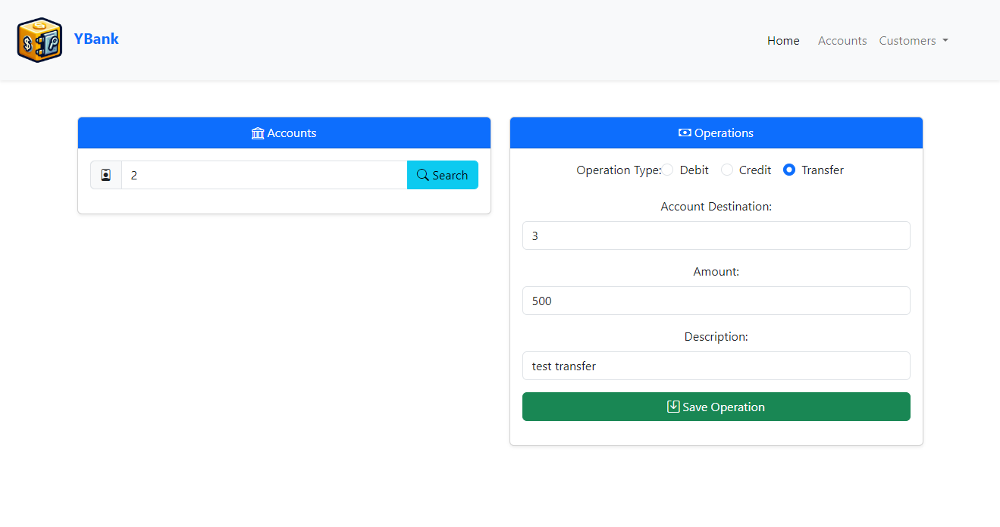
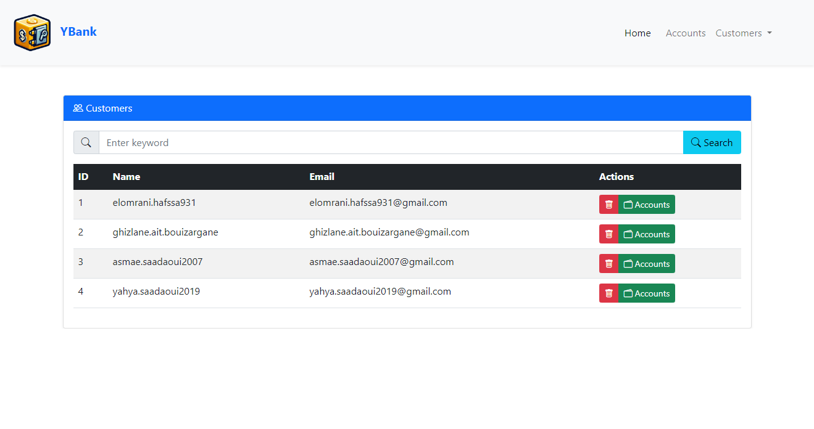
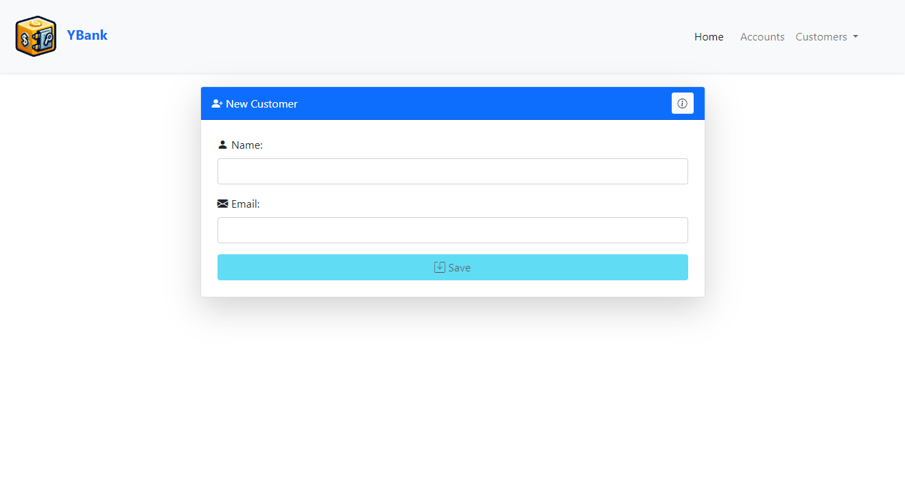
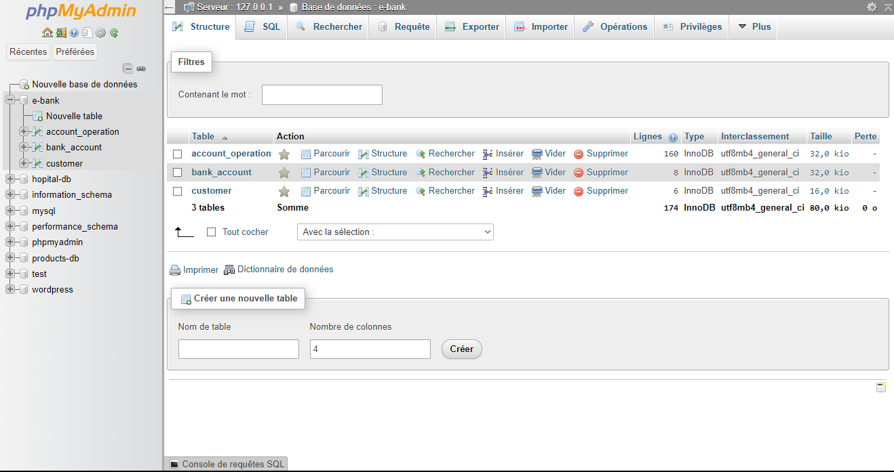

# Bank Account Management Application

## Overview

This project is designed to create an application for managing bank accounts. Each account belongs to a customer and can undergo various operations such as DEBIT or CREDIT. There are two types of accounts: Current Accounts and Saving Accounts.

## Project Structure

### Backend

#### Part 1 - Project Setup and DAO Layer

- **Create a Spring Boot Project**
    - Set up a Spring Boot project with the necessary dependencies.
- **Create JPA Entities**
    - Define JPA entities: `Customer`, `BankAccount`, `SavingAccount`, `CurrentAccount`, `AccountOperation`.
- **Create JPA Repository Interfaces**
    - Implement JPA repository interfaces based on Spring Data.
- **Test the DAO Layer**
    - Write tests to ensure the DAO layer functions correctly.

#### Part 2 - Service Layer and Web Layer

- **Service Layer, DTOs, and Mappers**
    - Implement the service layer with DTOs and mappers for data transfer and transformation.
- **RestController**
    - Develop RESTful web services to handle HTTP requests.
- **Test RESTful Web Services**
    - Ensure the web services are tested and functioning correctly.

### Frontend

#### Angular Client

- Develop a client-side application using Angular to interact with the backend services.

## Functionalities to Add

- **Customer Management**
    - Add, delete, edit, and search customers.
- **Account Management**
    - Add accounts, search and administer accounts.
- **User Operations Logging**
    - Log the ID of the authenticated user performing each operation on customers, accounts, and operations.
- **User Account and Password Management**
    - Allow users to manage their accounts and change their passwords.
- **Dashboard**
    - Create a dashboard using ChartJS (ng-chart) to display useful statistics and decision-making graphs.
- **Additional Functionalities**
    - Implement any other features as needed.

## Screenshots

Screenshots are located in the `screenshots` folder.

1. **Home Page**

    - The welcome page displays statistics such as the number of users, total cash in the bank, a graph of monthly visitors, and a pie chart of actions (DEBIT, CREDIT, TRANSFER).

2. **Account Page**
   
    - Contains a search by ID to select a user by ID. Once selected, various actions (DEBIT, CREDIT, TRANSFER) can be performed.

3. **Search Customer**
   
    - Displays a list of all clients in a table with a search bar to filter users by matching the written content.

4. **New User**
   
    - A form to add a new user by entering their name and email.
5. **Base De Données PhpMyAdmin**
   

## Getting Started

### Prerequisites

- Java Development Kit (JDK)
- Node.js and npm
- Angular CLI
- Spring Boot
- PostgreSQL or any other relational database

### Installation

1. **Backend**
    - Clone the repository and navigate to the backend folder.
    - Configure the database settings in `application.properties`.
    - Run the Spring Boot application.

2. **Frontend**
    - Navigate to the Angular client-side folder.
    - Install dependencies: `npm install`
    - Run the Angular application: `ng serve`

### Usage

- Access the Angular application at `http://localhost:4200`.
- Use the application to manage customers, accounts, and operations.
- View the dashboard for useful statistics and insights.

## Contributing

- Fork the repository.
- Create a new branch (`git checkout -b feature/YourFeature`).
- Commit your changes (`git commit -m 'Add some feature'`).
- Push to the branch (`git push origin feature/YourFeature`).
- Open a pull request.

## License

This project is licensed under the MIT License - see the LICENSE file for details.

## Contact

For any inquiries, please contact us at [ yahyasaadaoui@gmail.com ].

---
